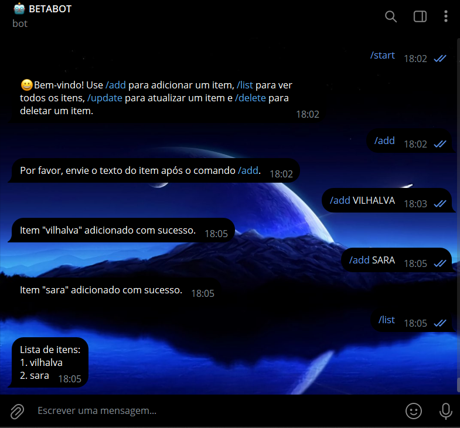
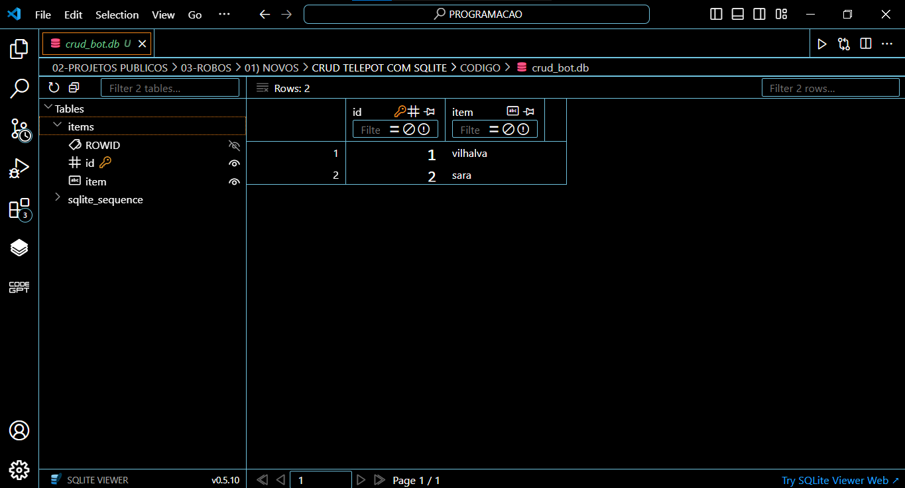

# CRUD TELEPOT COM SQLITE
🤤ESSE É UM BOT TELEGRAM DE CRUD DE ITENS, FEITO COM TELEPOT E SQLITE.

 <br>
 <br>

## DESCRIÇÃO:
Este bot do Telegram implementa um sistema básico de CRUD (Create, Read, Update, Delete) utilizando SQLite para armazenar e manipular itens. Aqui está uma descrição do que o bot faz:

1. **Inicialização (`/start`)**:
   - Mostra uma mensagem de boas-vindas e instruções sobre como utilizar o bot. O usuário pode iniciar a interação com o bot enviando `/start`.

2. **Adicionar Item (`/add`)**:
   - Permite adicionar um novo item à lista. O usuário envia o comando `/add` seguido pelo texto do item que deseja adicionar.
   - Exemplo: `/add Comprar leite`.

3. **Listar Itens (`/list`)**:
   - Mostra todos os itens atualmente armazenados na lista. O usuário envia o comando `/list`.
   - Exemplo de resposta:
     ```
     Lista de itens:
     1. vilhalva
     2. sara
     ```

4. **Atualizar Item (`/update`)**:
   - Permite atualizar o texto de um item existente na lista. O usuário envia o comando `/update ID NOVO_TEXTO`, onde `ID` é o número do item na lista e `NOVO_TEXTO` é o texto atualizado.
   - Exemplo: `/update 1 vilhalva22`.

5. **Deletar Item (`/delete`)**:
   - Permite remover um item da lista. O usuário envia o comando `/delete ID`, onde `ID` é o número do item na lista que deseja deletar.
   - Exemplo: `/delete 2`.

## EXECUTANDO O PROJETO:
1. **Coloque o Token:**
   - Antes de executar o bot, é necessário substituir o token do seu bot no arquivo `TOKEN.py`, o qual pode ser obtido por meio do [@BotFather](https://t.me/BotFather).

2. **Instalando as dependências:**
   - Certifique-se de instalar todas as dependências necessárias. No terminal, execute o seguinte comando para instalar as dependências listadas no arquivo `requirements.txt` em `CODIGO`:
   ```bash
   pip install -r requirements.txt
   ```

3. **Inicie o Bot:**
   - Execute o bot do Telegram em Python iniciando-o com o seguinte comando:
   ```bash
   python CODIGO.py
   ```

4. **Interagir com o Bot**:
   - Abra o Telegram e procure pelo seu bot. Envie o comando `/start` para começar.
   - Use os comandos `/add`, `/list`, `/update` e `/delete` conforme descrito para gerenciar a lista de itens.
   
## NÃO SABE?
- Entendemos que para manipular arquivos em muitas linguagens e tecnologias relacionadas, é necessário possuir conhecimento nessas áreas. Para auxiliar nesse aprendizado, oferecemos alguns subsidios:
* [VEJA A DOCUMENTAÇÃO](https://telepot.readthedocs.io/en/latest/)
* [CURSO DE PYTHON](https://github.com/VILHALVA/CURSO-DE-PYTHON)
* [CURSO DE SQLITE](https://github.com/VILHALVA/CURSO-DE-SQLITE)
* [CURSO DE PYTHON COM SQLITE](https://github.com/VILHALVA/CURSO-DE-PYTHON-COM-SQLITE)
* [CURSO SUGERIDO](https://github.com/VILHALVA/CURSO-DE-TELEBOT)
* [CONFIRA MAIS CURSOS](https://github.com/VILHALVA?tab=repositories&q=+topic:CURSO)

## CREDITOS:
- [PROJETO CRIADO PELO VILHALVA](https://github.com/VILHALVA)
